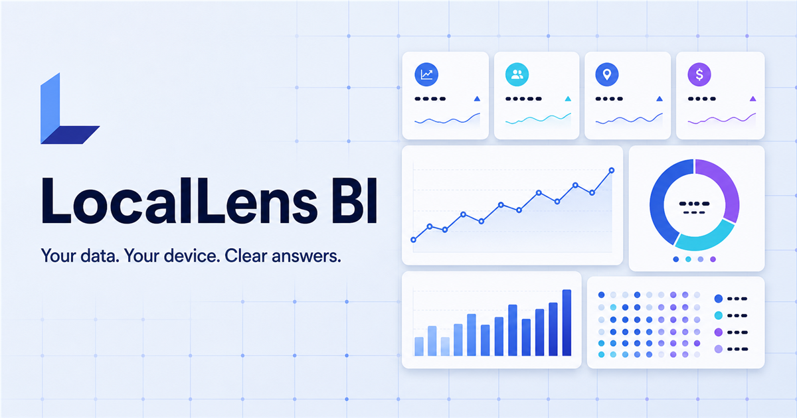
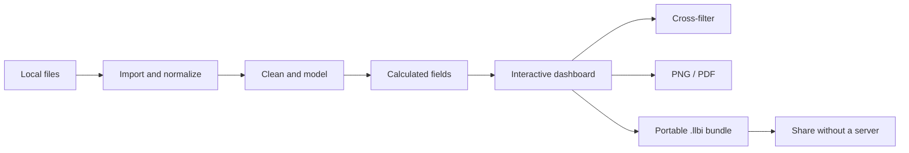

<div align="center">
  

  <h1>LocalLens BI</h1>

  <p><strong>Your data. Your device. Clear answers.</strong></p>
  <p>A polished, local-first analytics studio for turning files into interactive dashboards—without uploading a single row.</p>

  <p>
    <a href="./LICENSE"></a>
    
    
    
    
  </p>
</div>



## Analytics without the upload step

LocalLens BI brings the fast, visual authoring loop of a desktop BI tool into an auditable open-source application. Open a CSV, JSON document, Excel workbook, or SQLite database; model the data; build a dashboard; and export the result. The entire workflow stays on your machine.

There is no account, telemetry pipeline, hosted database, or cloud deployment requirement.

> [!IMPORTANT]
> LocalLens BI is intentionally local-only. Imported datasets and saved reports remain inside your browser and are never sent to an application server.

## Highlights

|     | Capability               | What it gives you                                                                   |
| --- | ------------------------ | ----------------------------------------------------------------------------------- |
| 📥  | **Multi-format import**  | CSV, JSON, Excel (`.xlsx`, `.xls`, `.xlsm`), and SQLite (`.db`, `.sqlite`)          |
| 🧹  | **Data preparation**     | Type overrides, text trimming, blank-value filling, search, and paginated previews  |
| 🧩  | **Semantic modeling**    | Multiple tables, lookup relationships, and reusable calculated fields               |
| 📊  | **Visual authoring**     | Bar, line, area, donut, KPI, and table visuals with per-chart formatting            |
| ✨  | **Interactive canvas**   | Drag, resize, duplicate, delete, and cross-filter visual cards                      |
| 💾  | **Local report library** | Autosave and reopen complete reports through browser IndexedDB                      |
| 📦  | **Portable output**      | Import/export `.llbi` report bundles and export dashboards as PNG or PDF            |
| 🔄  | **Source refresh**       | Manual refresh or 30-second, 1-minute, and 5-minute local refresh intervals         |
| 👥  | **Workflow roles**       | Owner, Editor, and Viewer modes for previewing report workflows                     |
| 🌗  | **Refined UI**           | Responsive layout, dark mode, accessible controls, and a ready-to-use sample report |

## See the workflow



## Quick start

### Requirements

- Node.js 22.13 or newer
- npm
- A modern browser; Chromium-based browsers provide the best persistent local-file refresh experience

### Development

```bash
git clone https://github.com/mohui666/locallens-bi.git
cd locallens-bi
npm install
npm run dev
```

Open the local URL printed by the development server.

### Local production build

```bash
npm run build
npm run start:local
```

The production application binds only to:

```text
http://127.0.0.1:4173
```

No Sites binding, hosted service, or external database is required.

## Build your first report

1. Select **Import** and choose one or more supported local files.
2. Open **Data & clean** to inspect fields, override types, trim text, or fill blanks.
3. Open **Model** to relate tables or add formulas such as `[revenue] - [cost]`.
4. Return to **Dashboard**, add visuals, and configure each chart in the inspector.
5. Click a chart value to cross-filter related visuals.
6. Save locally, export a portable `.llbi` bundle, or render the dashboard to PNG/PDF.

## Data model

LocalLens uses a deliberately compact semantic layer:

- **Tables** preserve normalized local rows and their source metadata.
- **Transforms** are non-destructive instructions applied during materialization.
- **Relationships** provide direct lookup joins between two table keys.
- **Calculated fields** use bracketed column references and a safe expression evaluator.
- **Filters** can flow from a visual to fields exposed through related tables.
- **Widgets** store both query configuration and responsive grid layout.

Example calculated fields:

```text
[revenue] - [cost]
[units] * [unit_price]
([revenue] - [cost]) / [revenue] * 100
```

## Architecture

```text
Browser
├── Import adapters
│   ├── Papa Parse        → CSV
│   ├── SheetJS           → Excel
│   ├── JSON parser       → JSON collections
│   └── sql.js + WASM     → SQLite
├── Local semantic engine
│   ├── transforms
│   ├── relationships
│   ├── calculated fields
│   └── cross-filters
├── React analytics studio
│   ├── responsive grid canvas
│   ├── Recharts visuals
│   └── visual inspector
└── Local persistence
    ├── IndexedDB report library
    ├── .llbi bundles
    └── PNG / PDF exports
```

### Core modules

| Module                                                               | Responsibility                                                     |
| -------------------------------------------------------------------- | ------------------------------------------------------------------ |
| [`app/page.tsx`](./app/page.tsx)                                     | Application shell, report authoring, navigation, and orchestration |
| [`lib/data-import.ts`](./lib/data-import.ts)                         | File adapters and row normalization                                |
| [`lib/bi-model.ts`](./lib/bi-model.ts)                               | Transforms, formulas, relationships, materialization, and filters  |
| [`lib/report-storage.ts`](./lib/report-storage.ts)                   | IndexedDB persistence and report library                           |
| [`components/bi/chart-visual.tsx`](./components/bi/chart-visual.tsx) | Six visual types and interaction handling                          |
| [`lib/sample-report.ts`](./lib/sample-report.ts)                     | Complete sample dataset, model, and dashboard                      |

## Privacy and security model

LocalLens BI is built around a small trust boundary:

- Data files are parsed in the browser.
- Reports are saved to that browser's IndexedDB.
- SQLite runs locally through WebAssembly.
- Exported report bundles contain the report data by design—treat them like the source files.
- Owner, Editor, and Viewer are local workflow guards, not multi-user authentication or server authorization.
- File refresh permission lasts only while the browser retains access to the selected handles.

## Performance boundaries

LocalLens BI currently caps each imported table at **250,000 rows**. Previews render 100 rows per page, while charts aggregate only the materialized fields they need. This keeps ordinary local analysis responsive without introducing a server-side query engine.

For datasets that exceed the browser's practical memory budget, reduce the source file or query it into a smaller SQLite table before import.

## Quality gates

```bash
npm test       # data inference, aggregation, cleaning, formulas, joins, filters, CSV/JSON/Excel import
npm run lint   # type-aware lint and React checks
npm run build  # production build
```

The current suite covers the core analytics and import paths with Node's native test runner.

## Current scope

LocalLens BI is a complete local authoring vertical slice, not a clone of every enterprise BI feature.

- The formula language is intentionally smaller than DAX.
- Relationships are direct lookup joins rather than a general-purpose query planner.
- Roles do not provide cryptographic access control.
- Collaboration uses portable bundles instead of a real-time server.
- Scheduled refresh works with browser-authorized local file handles.

These constraints keep the project private-by-default, understandable, and easy to run.

## Roadmap

- [ ] Lazy-load heavy import/export adapters for a smaller initial bundle
- [ ] Add pivot tables and scatter plots
- [ ] Add reusable report themes and dashboard templates
- [ ] Add relationship cardinality diagnostics
- [ ] Add optional DuckDB-WASM support for larger analytical workloads
- [ ] Add end-to-end browser tests for import, authoring, and export flows
- [ ] Add internationalization

## Contributing

Issues and pull requests are welcome. Before submitting a change:

1. Keep the default experience local-first and usable without an account.
2. Avoid introducing telemetry or outbound data transfer.
3. Add focused tests for data-model changes.
4. Run `npm test`, `npm run lint`, and `npm run build`.
5. Explain any change to the privacy or persistence boundary.

See [`CONTRIBUTING.md`](./CONTRIBUTING.md) for the full workflow and [`SECURITY.md`](./SECURITY.md) for responsible vulnerability reporting.

## Research

The product-selection rationale and open-source gap scan are documented in [`RESEARCH.md`](./RESEARCH.md). The goal is deliberately narrower than claiming that no open-source BI tools exist: LocalLens focuses on the underserved **local-file-first report authoring** workflow.

## License

LocalLens BI is released under the [MIT License](./LICENSE).

<div align="center">
  <sub>Built for analysts who want answers—not another upload screen.</sub>
</div>
