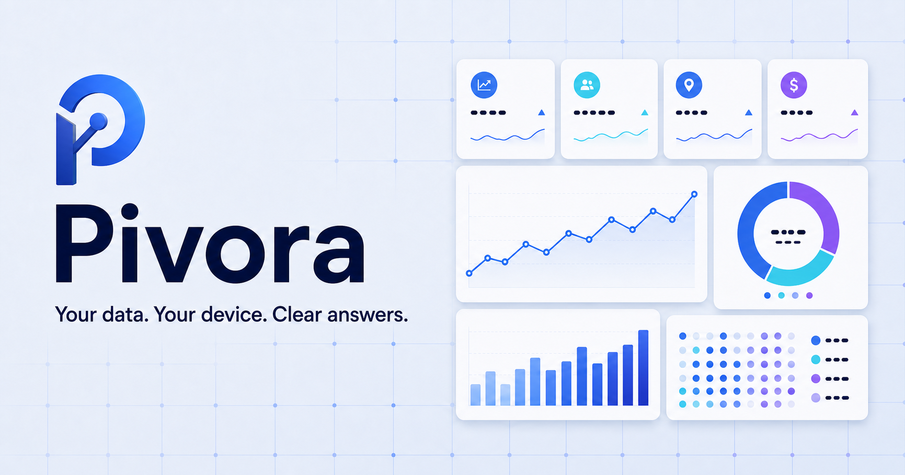
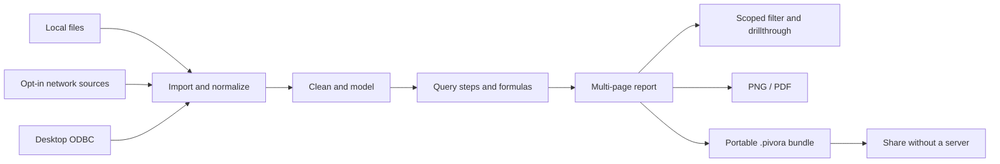

<div align="center">
  

  <h1>Pivora</h1>

  <p><strong>Your data. Your device. Clear answers.</strong></p>
  <p>A polished, local-first analytics studio for turning files into interactive dashboards—without uploading a single row.</p>

  <p>
    <a href="./LICENSE"></a>
    
    
    
    <a href="https://github.com/mohui666/pivora/actions/workflows/desktop.yml"></a>
    
  </p>
</div>

<p align="center"><em>Pivora = Pivot + Aurora — turn the data, reveal the pattern.</em></p>



## Analytics without the upload step

Pivora brings the fast, visual authoring loop of a desktop BI tool into an auditable open-source application. Open files, connect to explicitly selected sources, model data, run local DuckDB SQL, build dashboards, and export the result. Imported data and report state stay on your machine.

There is no account, telemetry pipeline, hosted database, or cloud deployment requirement.

> [!IMPORTANT]
> Pivora is intentionally local-first. Imported files, model tables, SQL queries, and saved reports remain inside your browser unless you explicitly use a network connector.

## Highlights

|     | Capability               | What it gives you                                                                                           |
| --- | ------------------------ | ----------------------------------------------------------------------------------------------------------- |
| 📥  | **Multi-format import**  | CSV, JSON, XML, Parquet, Excel, SQLite, folders, and binary-safe Web/API GET                                |
| ☁️  | **Data-lake discovery**  | Paginated S3-compatible, Azure Blob, and Google Cloud Storage listings, plus explicit URL manifests         |
| 🔌  | **Desktop ODBC**         | Installed Windows DSNs/drivers and guarded read-only `SELECT`/`WITH` query imports                          |
| 🧹  | **Data preparation**     | 14 ordered query operations, including merge, append, pivot, unpivot, cleaning, profiling, and previews     |
| 🧩  | **Semantic modeling**    | Four cardinalities, diagnostics, formulas, measures, what-if parameters, and curated column metadata        |
| 📊  | **Visual authoring**     | 14 visuals, hierarchies, drillthrough, conditional scales, secondary measures, sorting, and Top N           |
| ✨  | **Report authoring**     | Multi-page canvas, auto-snap or overlapping freeform layout, scoped filters, interactions, themes, and undo |
| 💾  | **Local report library** | Autosave and reopen complete reports through browser IndexedDB                                              |
| 🛟  | **Workspace recovery**   | Reopen the last active report and restore from up to 30 compressed manual/automatic local checkpoints       |
| 🧱  | **Report templates**     | Start blank or use guided retail, executive, and live scenario-planning report structures                   |
| 🖥️  | **Windows desktop**      | Signed-ready installer and portable app with an embedded private localhost runtime                          |
| 🌐  | **English & 简体中文**   | Persistent in-app language switching across authoring, modeling, SQL, recovery, and desktop diagnostics     |
| 🧠  | **Local SQL workbench**  | Read-only DuckDB-WASM queries over materialized report tables, with history and reusable results            |
| 📦  | **Portable output**      | Import/export `.pivora` (plus legacy `.llbi`), active-page PNG, and multi-page PDF                          |
| ⚡  | **On-demand engines**    | Charting, import adapters, DuckDB, PNG, Excel, and PDF code load only when the workflow needs them          |
| ⏱️  | **Performance analyzer** | Measure local aggregation time, input rows, and output points for every visual on a page                    |
| 🔄  | **Source refresh**       | Manual refresh or 30-second, 1-minute, and 5-minute local refresh intervals                                 |
| 👥  | **Role-aware preview**   | Owner, Editor, Viewer, and field/operator row rules that also constrain local SQL                           |
| 🌗  | **Refined UI**           | Responsive layout, dark mode, accessible controls, and a ready-to-use sample report                         |

## See the workflow



## Quick start

### Windows desktop

Download either `Pivora-Setup-*.exe` or `Pivora-Portable-*.exe` from [GitHub Releases](https://github.com/mohui666/pivora/releases). The desktop build includes its own local engine; Node.js, a separate browser, an account, and a cloud service are not required.

The installer preserves Pivora's local application data when uninstalling. The portable executable stores reports in the current Windows user's Pivora application-data directory, so moving or replacing the `.exe` does not erase saved reports.

### Requirements

- Node.js 22.13 or newer
- npm
- A modern browser; Chromium-based browsers provide the best persistent local-file refresh experience

### Development

```bash
git clone https://github.com/mohui666/pivora.git
cd pivora
npm install
npm run dev
```

Open the local URL printed by the development server.

Use the language selector in the top toolbar to switch between **English** and **简体中文**. The choice is saved locally and restored the next time Pivora opens.

### Local production build

```bash
npm run build
npm run start:local
```

The production application binds only to:

```text
http://127.0.0.1:4173
```

No Sites binding, hosted service, or external database is required.

### Build the Windows desktop app

```bash
npm run desktop:dir   # unpacked application for local inspection
npm run desktop:dist  # NSIS installer + portable executable
npm run desktop:smoke # launch and verify the packaged application
```

Desktop artifacts are written to `release/`. The packaged application owns the fixed loopback origin `http://127.0.0.1:4173`; if another process already uses that port, Pivora fails closed and displays a retryable diagnostics page instead of loading an unknown local service.

## Build your first report

1. Select **New** to start from a blank canvas or guided local template. Choose **Import** for local files, or **Connect** for Web/API, data-lake, and desktop ODBC sources.
2. Open **Data & clean** to build an ordered preparation pipeline, clean columns non-destructively, and inspect quality, frequency, and numeric distribution for every field.
3. Open **Model** to define relationships, formulas such as `[revenue] - [cost]`, reusable measures, row rules, what-if parameters, and report-facing column metadata.
4. Return to **Dashboard**, choose **Auto snap** or **Freeform**, create pages, add visuals, and configure aggregations, quick calculations, filter scopes, visual interactions, synced slicers, and page drillthrough fields. Freeform keeps fine positions, allows intentional overlap, and grows into a scrollable canvas when visuals move beyond the initial viewport.
5. Click a chart value to cross-filter related visuals or transfer its context into a configured drillthrough page; capture useful states as bookmarks.
6. Apply a report theme, undo/redo edits, save a restorable checkpoint, export a portable `.pivora` bundle, or render the active page to PNG/PDF.

## Data model

Pivora uses a deliberately compact semantic layer:

- **Tables** preserve normalized local rows and their source metadata.
- **Query steps** form an ordered non-destructive pipeline: filter, sort, remove duplicates, keep first rows, add index, replace, rename, split, create custom columns, group/aggregate, append, merge, unpivot, and pivot. Cross-table dependencies are resolved with cycle protection.
- **Transforms** override types, trim strings, fill blanks, or exclude columns during materialization.
- **Relationships** support one-to-one, one-to-many, many-to-one, and many-to-many cardinalities, active state, and single/bidirectional filtering.
- **Calculated fields** use bracketed column and parameter references through a safe expression evaluator.
- **What-if parameters** provide bounded numeric values and live sliders; formulas can reference them by name, such as `[revenue] * (1 + [Scenario uplift] / 100)`.
- **Reusable measures** centralize field aggregation, number format, and calculation behavior for use across visuals.
- **Column metadata** stores report-facing names, descriptions, data categories, default number formats, hidden-field state, and sort-by-column rules without renaming source data.
- **Aggregations** include sum, average, count, distinct count, minimum, and maximum, followed by optional running total, percent-of-total, previous-period difference, percent change, or ranking.
- **Filters** support report, page, selected-visual, and interaction scopes with seven operators; a per-source/target interaction matrix can suppress individual visual links, while named slicer groups synchronize across pages.
- **Drillthrough pages** declare one or more target fields and can transfer the selected value alone or preserve the full source context.
- **Column profiles** calculate valid, empty, error, and distinct counts alongside top values, histograms, min/max, mean, median, and standard deviation.
- **Pages, bookmarks, and themes** capture presentation and filter state without changing source data.
- **Widgets** store query configuration, visibility, formatting, interactions, and a persisted 12-column snap or growing freeform layout. Freeform visuals may overlap or extend beyond the initial viewport; its scrollable canvas expands without changing existing pixel positions, and the selected or actively dragged visual rises to the front. Invalid legacy geometry is repaired when a report opens.

Example calculated fields:

```text
[revenue] - [cost]
[units] * [unit_price]
([revenue] - [cost]) / [revenue] * 100
[revenue] * (1 + [Scenario uplift] / 100)
```

## Architecture

```text
Pivora
├── Optional Electron desktop shell
│   ├── sandboxed renderer with Node.js disabled
│   ├── loopback-only Utility Process runtime
│   ├── origin-checked Windows ODBC bridge
│   ├── startup health check and diagnostics log
│   └── NSIS installer + portable Windows target
└── Browser application
    ├── Import adapters
    │   ├── Papa Parse        → CSV
    │   ├── SheetJS           → Excel
    │   ├── JSON parser       → JSON collections
    │   ├── DOM parser        → XML collections
    │   ├── Hyparquet         → Parquet + compression codecs
    │   ├── sql.js + WASM     → SQLite
    │   ├── explicit fetch    → Web/API CSV, JSON, XML, Parquet, Excel, and SQLite
    │   └── provider listings → S3-compatible, Azure Blob, GCS, and URL manifests
    ├── Local semantic engine
    │   ├── transforms
    │   ├── ordered query steps
    │   ├── relationships
    │   ├── calculated fields
    │   ├── reusable measures
    │   ├── column metadata
    │   ├── what-if parameters
    │   ├── quick calculations
    │   ├── relationship diagnostics
    │   ├── role row rules
    │   ├── scoped filter contexts and visual interaction rules
    │   └── drillthrough transfer
    ├── DuckDB-WASM workbench
    │   ├── read-only SQL worker
    │   ├── query history
    │   └── reusable result tables
    ├── React analytics studio
    │   ├── responsive grid canvas
    │   ├── 14 Recharts/CSS visuals
    │   ├── pages, bookmarks, themes, drillthrough, and synced slicers
    │   ├── column quality and distribution profiler
    │   └── visual inspector
    └── Local persistence
        ├── IndexedDB report library
        ├── last-workspace recovery and 30-version local history
        ├── .pivora bundles
        └── PNG / PDF exports
```

### Core modules

| Module                                                               | Responsibility                                                     |
| -------------------------------------------------------------------- | ------------------------------------------------------------------ |
| [`app/page.tsx`](./app/page.tsx)                                     | Application shell, report authoring, navigation, and orchestration |
| [`lib/data-import.ts`](./lib/data-import.ts)                         | File adapters and row normalization                                |
| [`lib/data-lake.ts`](./lib/data-lake.ts)                             | Object discovery, pagination, selection, and bounded downloads     |
| [`desktop/odbc-bridge.mjs`](./desktop/odbc-bridge.mjs)               | Windows DSN inventory and guarded read-only query execution        |
| [`lib/duckdb-engine.ts`](./lib/duckdb-engine.ts)                     | Browser-local read-only DuckDB SQL execution                       |
| [`lib/bi-model.ts`](./lib/bi-model.ts)                               | Transforms, formulas, relationships, materialization, and filters  |
| [`lib/report-storage.ts`](./lib/report-storage.ts)                   | IndexedDB persistence and report library                           |
| [`lib/report-schema.ts`](./lib/report-schema.ts)                     | Backward-compatible report upgrades and built-in themes            |
| [`lib/grid-layout.ts`](./lib/grid-layout.ts)                         | Layout modes, geometry conversion, bounds, and recovery            |
| [`components/bi/chart-visual.tsx`](./components/bi/chart-visual.tsx) | Fourteen visual types and interaction handling                     |
| [`lib/sample-report.ts`](./lib/sample-report.ts)                     | Complete sample dataset, model, and dashboard                      |

## Privacy and security model

Pivora is built around a small trust boundary:

- Data files are parsed in the browser.
- Web/API and data-lake calls occur only after an explicit action. Request headers, SAS parameters, and presigned URL queries remain session-only; imported rows retain only a query-free source label.
- ODBC connection strings and SQL stay in renderer memory and are never written into the report. Only imported rows and non-secret source metadata persist.
- The Windows ODBC bridge accepts one `SELECT`/`WITH` statement at a time, rejects write-capable keywords, caps results at 100,000 rows, and enforces process/output limits.
- Reports, the last-open workspace pointer, and retained version checkpoints are saved to that browser's IndexedDB.
- SQLite and DuckDB SQL run locally through WebAssembly.
- Exported report bundles contain the report data by design—treat them like the source files.
- Owner, Editor, and Viewer are local workflow guards, not multi-user authentication or server authorization.
- File refresh permission lasts only while the browser retains access to the selected handles.
- The desktop renderer runs with context isolation and Chromium sandboxing, with Node.js integration disabled and all permission requests denied.
- The desktop shell accepts only the Pivora loopback origin in-app; external HTTP(S) links are handed to the operating-system browser, while pop-up windows, webviews, and non-HTTP navigation are blocked.
- The embedded worker binds only to `127.0.0.1`, validates the Pivora response before loading it, and is terminated with its Workerd children when the desktop window closes.

## Performance boundaries

Pivora currently caps each imported table at **250,000 rows**, each data-lake object download at **512 MB**, and each ODBC result at **100,000 rows**. Previews render 100 rows per page, charts aggregate only the materialized fields they need, and the optional DuckDB-WASM engine executes SQL in a Web Worker. Chart rendering, data-import adapters, DuckDB, PNG capture, Excel, and PDF exporters are split from the initial application bundle and fetched only when their workflows are opened.

For datasets that exceed the browser's practical memory budget, reduce the source file or query it into a smaller SQLite table before import.

## Quality gates

```bash
npm test          # 53 focused checks, including data-lake discovery and the desktop ODBC bridge
npm run lint      # type-aware lint, React checks, and desktop-process checks
npx tsc --noEmit --incremental false # independent TypeScript check
npm run build     # production web build and split-asset validation
npm run test:e2e  # production-server Chromium workflows
npm run desktop:smoke # packaged Windows startup and shutdown probe
```

The Node suite covers analytics, imports, connector pagination, ODBC query guards, schema behavior, localization, recovery, and layout logic. Playwright then builds and starts the production application and exercises language persistence; CSV import, table switching, visual creation, freeform drag/resize, `.pivora` and PNG export; and a data-lake-manifest plus desktop ODBC import workflow. The E2E checks also ensure heavy SQL and export engines stay out of the initial page load. Packaged desktop smoke tests additionally probe the Windows ODBC inventory bridge.

## Current scope

Pivora is a capable local report authoring application, not a binary-compatible clone of Power BI or its cloud service.

- The formula language is intentionally smaller than DAX.
- Query steps cover common file-preparation workflows but do not execute Power Query M.
- Relationships are materialized in-browser rather than executed by a distributed query planner.
- Roles do not provide cryptographic access control.
- Collaboration uses portable bundles instead of a real-time server.
- Scheduled refresh works with browser-authorized local file handles.
- Data-lake endpoints must be public/CORS-enabled or use explicitly supplied session headers, SAS parameters, or presigned manifest URLs; Pivora does not manage cloud IAM credentials.
- ODBC import is available only in the Windows desktop build and depends on a compatible installed 64-bit driver.
- Power BI Service-only features such as Microsoft tenant workspaces, gateways, Fabric, and Azure-managed deployment are outside the local-only trust boundary.

These constraints keep the project private-by-default, understandable, and easy to run.

## Roadmap

- [x] Multi-page reports, bookmarks, themes, and undo/redo
- [x] Matrix, scatter, funnel, waterfall, treemap, gauge, combo, and slicer visuals
- [x] Ordered query steps and extended/quick calculations
- [x] Parquet, folder import, reusable measures, drill hierarchies, conditional scales, and performance analysis
- [x] Lazy-load heavy import/export adapters for a smaller initial bundle
- [x] Add relationship cardinality diagnostics
- [x] Add drill hierarchies, conditional formatting, and multi-page PDF export
- [x] Add local DuckDB-WASM SQL, reusable query results, and production-safe split assets
- [x] Add opt-in Web/API JSON, CSV, and XML connector
- [x] Add local row-level role rules and filtered SQL previews
- [x] Add report/page/visual filter scopes with operator-aware authoring
- [x] Add live numeric what-if parameters for calculated-field formulas
- [x] Add configured drillthrough pages with optional full-context transfer
- [x] Add column quality, top-value, histogram, and descriptive-statistics profiling
- [x] Add append, merge, pivot, and unpivot query steps with dependency-cycle protection
- [x] Add per-visual interaction controls and cross-page synchronized slicers
- [x] Add display names, descriptions, categories, default formats, hidden fields, and sort-by-column metadata
- [x] Add last-workspace crash recovery and retained local version checkpoints
- [x] Add blank, guided retail, executive, and scenario-planning report templates
- [x] Add stable table resizing, explicit table switching, and auto-snap/freeform canvas modes
- [x] Add local Windows installer/portable builds with sandboxing, startup diagnostics, and packaged smoke tests
- [x] Add a guarded Windows ODBC bridge and paginated S3-compatible, Azure Blob, GCS, and manifest data-lake connectors
- [x] Add repeatable end-to-end browser tests for import, authoring, and export flows
- [x] Add persistent English and Simplified Chinese internationalization

## Contributing

Issues and pull requests are welcome. Before submitting a change:

1. Keep the default experience local-first and usable without an account.
2. Avoid introducing telemetry or outbound data transfer.
3. Add focused tests for data-model changes.
4. Run `npm test`, `npm run lint`, and `npm run build`.
5. Explain any change to the privacy or persistence boundary.

See [`CONTRIBUTING.md`](./CONTRIBUTING.md) for the full workflow and [`SECURITY.md`](./SECURITY.md) for responsible vulnerability reporting.

## Research

The product-selection rationale and open-source gap scan are documented in [`RESEARCH.md`](./RESEARCH.md). The goal is deliberately narrower than claiming that no open-source BI tools exist: Pivora focuses on the underserved **local-file-first report authoring** workflow.

## License

Pivora is released under the [MIT License](./LICENSE).

<div align="center">
  <sub>Built for analysts who want answers—not another upload screen.</sub>
</div>
